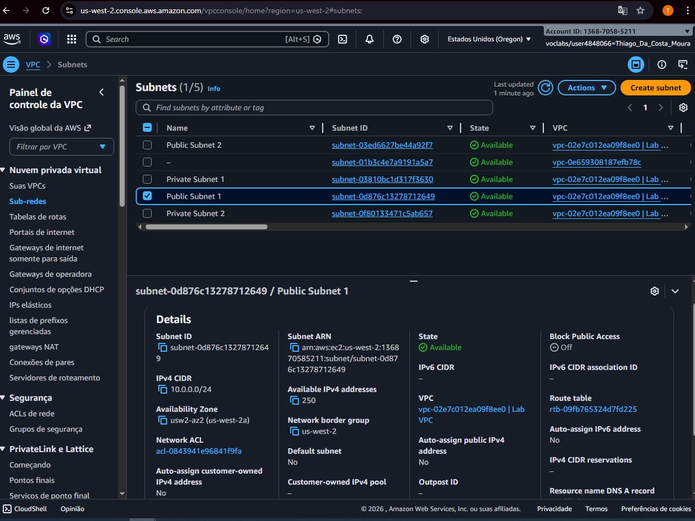
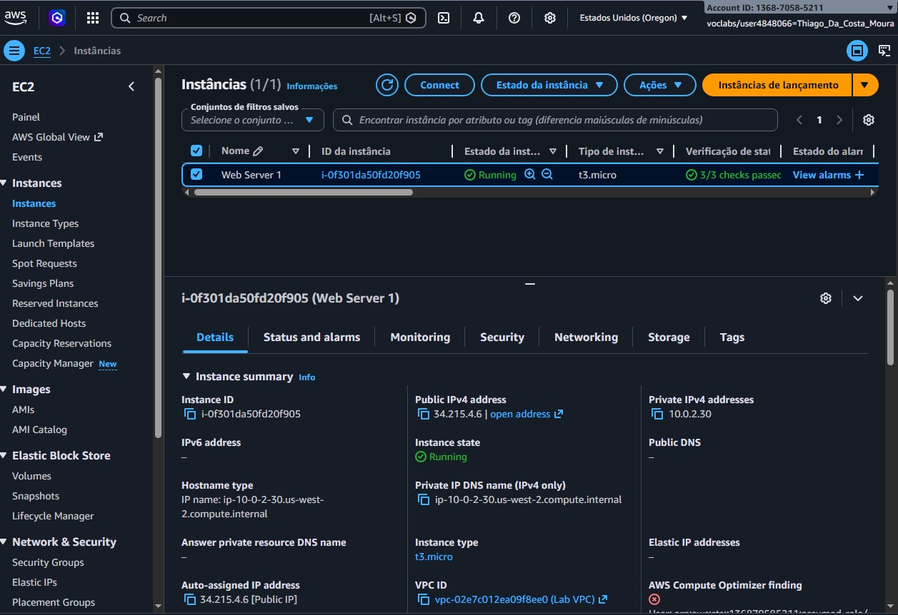

# Projeto AWS: VPC e Web Server

Este repositório contém a documentação e evidências do laboratório de implementação de uma infraestrutura escalável na AWS.

## 🌐 Infraestrutura de Rede (VPC)

> **Legenda:** Implementação de subnets públicas e privadas com CIDR 10.0.0.0/16, garantindo isolamento e alta disponibilidade entre Zonas de Disponibilidade.

## 🖥️ Servidor Web (EC2)

> **Legenda:** Instância operacional com status 2/2 checks passed na região us-west-2 (Oregon), validando a integridade do hardware e sistema operacional.

## 🛠️ Tecnologias Utilizadas
* **Cloud:** AWS (VPC, EC2, Subnets, IGW)
* **Região:** us-west-2
* **Instância:** t3.micro
