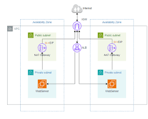

# AWS-VPC-EC2-WEBSERVER
# Implementação de Infraestrutura AWS Robusta e Segura ☁️

## 📝 Descrição do Projeto
Este projeto foi desenvolvido como parte do meu treinamento no programa **AWS re/Start (Escola da Nuvem)**. O desafio foi projetar e implementar uma infraestrutura de rede isolada (VPC) em múltiplas Zonas de Disponibilidade, focando em segurança e alta disponibilidade para o lançamento de um servidor web.

A arquitetura foi construída com base nos requisitos técnicos apresentados pelo cliente.

## 🛠️ Detalhes Técnicos da Arquitetura (Baseado no Diagrama)
A solução implementada conta com os seguintes componentes-chave:

1. **Rede (VPC):** Criação de uma VPC customizada (CIDR `10.0.0.0/16`) segmentada para garantir segurança.
2. **Alta Disponibilidade:** A infraestrutura é distribuída em duas **Availability Zones (AZ-A e AZ-B)** na mesma Região, prevenindo quedas em caso de falha de um datacenter inteiro.
3. **Segurança de Subnets:**
   - **Subnets Públicas (`10.0.0.0/24`, `10.0.2.0/24`):** Onde ficam os recursos voltados para a internet, como o Internet Gateway.
   - **Subnets Privadas (`10.0.1.0/24`, `10.0.3.0/24`):** Áreas isoladas da internet para recursos sensíveis (ex: banco de dados), garantindo segurança.
4. **Conectividade:**
   - **Internet Gateway:** Permite que recursos nas subnets públicas (como o servidor web) se comuniquem com a internet.
   - **NAT Gateway (na AZ-A):** Permite que instâncias nas subnets privadas baixem atualizações ou acessem a internet de forma segura, sem serem acessíveis externamente.
5. **Roteamento:** Configuração detalhada de tabelas de roteamento públicas e privadas para gerenciar o fluxo de tráfego, conforme as tabelas mostradas no diagrama.
6. **Computação e Segurança:**
   - **EC2 (Web Server 1):** Provisionado na Subnet Pública 2 na AZ-B.
   - **Security Groups:** Configurados para restringir o acesso ao servidor web, aceitando tráfego apenas nas portas necessárias (ex: HTTP 80 para a web).

## 📸 Diagrama da Arquitetura
A imagem abaixo representa a infraestrutura final que foi implementada:

## ✅ Resultado
O projeto foi concluído com sucesso, resultando em uma infraestrutura pronta para produção, que isola os recursos críticos e fornece a conectividade necessária de forma segura.

## 🔗 Sobre Mim
- Meu perfil no GitHub: ThiagoMouraInfoCloud
- Meu perfil no LinkedIn: www.linkedin.com/in/thiago-moura-infracloud
